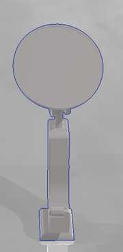
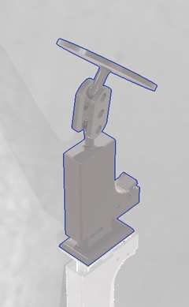

# PocketPivot

<p align="center">
  <strong>Compact, low-cost MagSafe phone stand for recording, viewing, and everyday positioning</strong>
</p>

---

## Complete Assembly


PocketPivot is a mechanically adjustable support designed for MagSafe-compatible smartphones. It provides stable and practical phone positioning for content creation, photography, video calls, tutorials, and hands-free media viewing.

---

## PocketPivot in Motion

<p align="center">
  <a href="assets/videos/PocketPivot.mp4">
    
  </a>
</p>

<p align="center">
  <strong>▶ Watch the mechanical positioning demo</strong><br>
  <sub>Click the preview to open the full PocketPivot MP4 demonstration.</sub>
</p>

---

## Mechanical Design Views

| Front Perspective | Front View | Rear Mechanism |
|:---:|:---:|:---:|
|  |  |  |
| Circular MagSafe interface, upper joint, compact body, and support base. | Alignment of the magnetic plate, central structure, and lower positioning mechanism. | Articulated joint and rear mechanism used to control phone orientation. |

---

## Overview

**PocketPivot** combines a compact mechanical architecture with MagSafe magnetic attachment to provide stable and repeatable smartphone positioning. The project is intended as an accessible alternative to higher-cost commercial stands while preserving portability, adjustability, and practical mechanical reliability.

Its primary purpose is to help users position a smartphone at suitable angles for:

- Recording videos and short-form content.
- Photography and product shots.
- Video calls and online meetings.
- Following tutorials, demonstrations, or recipes.
- Enjoying multimedia content hands-free.

---

## Main Features

- MagSafe-compatible circular mounting interface.
- Adjustable positioning for recording and content viewing.
- Compact and foldable mechanical architecture.
- Stable support across multiple practical angles.
- Low-cost fabrication using accessible manufacturing methods.
- Editable native SolidWorks source files.
- STEP exports for cross-platform CAD compatibility.
- STL files for prototyping and 3D printing.

---

## Repository Structure

```text
PocketPivot/
├── README.md
├── SolidWorks/
│   ├── *.SLDPRT
│   ├── *.SLDASM
│   └── *.SLDDRW
├── STEP/
│   └── *.STEP
├── STL/
│   └── *.STL
└── assets/
    ├── figures/
    │   ├── pocketpivot_full_assembly.jpg
    │   ├── pocketpivot_front_perspective.jpg
    │   ├── pocketpivot_front_view_fixed.jpg
    │   └── pocketpivot_rear_mechanism_fixed.jpg
    └── videos/
        └── PocketPivot.mp4
```

---

## CAD Files

| Directory | Contents |
| --- | --- |
| [`SolidWorks/`](SolidWorks/) | Editable parts, assemblies, and technical drawings |
| [`STEP/`](STEP/) | Neutral CAD files for exchange and manufacturing review |
| [`STL/`](STL/) | Mesh exports for rapid prototyping and 3D printing |
| [`assets/figures/`](assets/figures/) | CAD renders and visual project documentation |
| [`assets/videos/`](assets/videos/) | PocketPivot motion demonstrations |

---

## Project Status

The current CAD revision presents the resolved mechanical arrangement shown in the design views. Dimensions, tolerances, magnetic attachment details, and manufacturing parameters may continue to be refined during physical prototyping and testing.

---

## Manufacturing Notes

Before fabrication, verify:

- Final dimensions and smartphone clearance.
- Joint tolerances and required mechanical friction.
- Magnet diameter, thickness, polarity, and retention method.
- Print orientation and support requirements.
- Clearance between moving and mating components.

---

<p align="center">
  <strong>Position better. Record smarter. Carry less.</strong>
</p>